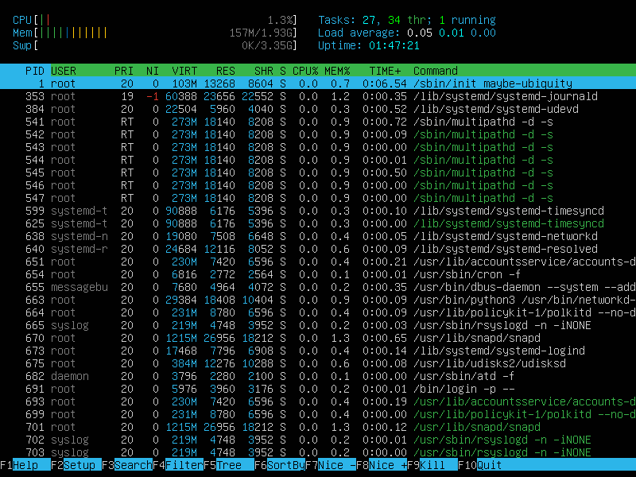

# Linux Report
## Part 1. Installation of the OS
- installed Ubuntu 20.04.6 live server image and powered up a new VM on VirtualBox (1 CPU, 2048M RAM, 30G Hard Disk)

 

  
<em>Output of <code>cat /etc/issue</code></em>  

 

## Part 2.  Creating a user
- created a new user with <code>sudo useradd [OPTIONS] [USERNAME]</code>, where the user is added to <strong>user, adm, sudo</strong> groups and login shell is set to <strong>/bin/bash</strong> 

- new password is set with <code>sudo passwd [USERNAME]</code>

- checked that the user is in the correct groups

 

  
<em>New user added to the system</em>

 

- checked that the user is present in <code>/etc/passwd</code>

 

  
<em>User present in output of <code>cat /etc/passwd</code></em>

 

## Part 3. Setting up the OS network
### 3.1

- set hostname using <code>sudo hostname user-1</code> followed by <code>hostnamectl set-hostname user-1</code>

- checked that <code>hostname</code> and <code>hostnamectl</code> produce output <code>user-1</code> (static hostname)

- ran <code>reboot</code> to update the displayed name

### 3.2

- to set timezone, turned off NTP using <code>timedatectl set-ntp no</code> then ran <code>timedatectl set-timezone Europe/Moscow</code>

- checked time and date by running <code>date</code>

### 3.3

- listed network interfaces using <code>ls /sys/class/net</code>

 

  
<em>Output of network interfaces</em>

 

- <strong>lo</strong> is a special virtual loopback interface the computer uses to communicate with itself; it can serve as a means of troubleshooting and connect apps and systems on the same machine

### 3.4

- installed <strong>DHCP (Dynamic Host Configuration Protocol)</strong> server using <code>sudo apt install isc-dhcp-server</code>

- added default DHCP server configuration to <code>/etc/dhcp/dhcpd.conf</code> file in Vim

 

  
<em>Default DHCP configuration lets the server assign IPs from 10.1.1.3 to 10.1.1.254 that expire by default after 600 seconds, maximum after 7200 seconds</em>

 

- installed DHCP client using <code>sudo apt install isc-dhcp-client</code>

- ran <code>sudo dhclient</code>, then <code>less /var/lib/dhcp/dhclient.leases</code> to display IP assigned by DHCP server

 

  
<em>IP address from DHCP server is 10.0.2.2</em>

### 3.5

- internal or private IP (also default gateway or gw) is the address connecting device to a router (usually in a home/local network); here <strong>10.0.2.2</strong>, dhcp-server-identifier

- external or public IP is the address the router uses to access external networks; here <strong>176.77.60.227</strong>

 

  
<em>External IP as output of <code>curl ident.me</code></em>

### 3.6

- set static IP, gateway and DNS server by running <code>sudo vim /etc/netplan/00-installer-config.yaml</code> and altering to the following:

 

  
<em>Static IP, gateway and DNS server settings for netplan</em>

### 3.7

- ran <code>sudo netplan generate && sudo netplan try</code>, then applied the changes and rebooted

- checked that IP and gw addresses haven't changed

- pinged 1.1.1.1 and ya.ru with 0% packet loss

 

  
<em>Output of <code>ping 1.1.1.1</code> and <code>ping ya.ru</code></em>

 

## Part 4. OS Update 
- ran <code>sudo apt update</code>, then <code>sudo apt upgrade</code>

- ran the procedure again, got 0 packages to upgrade

 

  
<em>No system updates available</em>

 

## Part 5. Using the sudo command

- <strong>sudo</strong> is a program for Unix-like computer operating systems that allows users to run programs with the security privileges of another user (normally the superuser, or root); the name is a concatenation of "su" (substitute user) and "do"

- switched user with <code>su - evgeny</code>

- changed hostname to new-name and verified the change

 

  
<em>Hostname changed to new-name</em>

 

## Part 6. Installing and configuring the time service
- current time is in Europe/Moscow timezone shown via <code>date</code>

- ran <code>timedatectl set-ntp yes</code>, then <code>timedatectl show</code>

 

  
<em><code>timedatectl show</code> and <code>date</code> output</em>

 

## Part 7. Installing and using text editors
- to install Vim, Nano, Ne: <code>sudo apt install [NAME]</code>; to open new file: <code>[NAME] test_NAME.txt</code>, where NAME is the name of text editor

### Vim

- press <code>i</code> to edit, <code>Esc</code> to exit insert mode

- <code>:wq</code> or <code>:x</code> to save and close file

- <code>:q</code> to close without saving

- <code>?</code> or <code>/</code> followed by a word to search within file, use <code>n</code> to find the next occurrence of the word

- <code>:s/search/replace/g</code> to replace all words matching 'search' in the current line; <code>:%s/search/replace/g</code> to replace all words matching 'search' in all lines

 

  
<em>Opened, edited and saved a new file</em>

 

  
<em>Edited and closed file without saving</em>

 

  
<em>Searched for a word 'word'</em>

 

  
<em>Found all matches for 'test' and replaced them with 'crab'</em>

### Nano

- edit file, press <code>Ctrl + x</code> to exit, then <code>Y</code> to save or <code>N</code> to close without saving

- to find a word: <code>Ctrl + w</code>, enter the word and press <code>Enter</code>; the cursor will move to the nearest match, pressing <code>Alt + w</code> will move it to the next match

- to replace a word: <code>Ctrl + \\</code>, enter the word to search for and word to replace it with; press <code>Y/N</code> to confirm each replacement or <code>A</code> to replace all matches

 

  
<em>Opened, edited and saved a new file</em>

 

  
<em>Edited and closed file without saving</em>

 

  
<em>Searched for a word 'goose'</em>

 

  
<em>Found all matches for 'goose' and replaced them with 'duck'</em>

### Ne

- edit file, press <code>Esc</code> to open menu, navigate using arrows; 

- press <strong>Save&Exit</strong> to save, <strong>Quit Now</strong> and <code>Y</code> to close file without saving

- to find the nearest match: press <strong>Find</strong>, enter a word and hit <code>Enter</code>; press <strong>Repeat Last</strong> to go to the next match

- to replace all last searched matches with a word: press <strong>Replace All</strong>, enter a word and hit <code>Enter</code>

 

  
<em>Opened, edited and saved a new file</em>

 

  
<em>Edited and closed file without saving</em>

 

  
<em>Searched for a word 'quack'</em>

 

  
<em>Found all matches for 'quack' and replaced them with 'ribbit'</em>

 

## Part 8. Installing and basic setup of the SSHD service
### 8.1

- ran <code>sudo apt-get install sshd</code>, then <code>sudo apt-get install openssh-server</code>

- started the server with <code>service sshd start</code> and viewed the status via <code>sudo service sshd status</code>

### 8.2

- ran <code>sudo systemsctl enable ssh.service</code> and rebooted to check that the service starts automatically on boot

### 8.3

- edited <code>/etc/ssh/sshd_config</code> to display <strong>Port 2022</strong>

- ran <code>sudo systemctl restart ssh</code>

 

  
<em>Changed port to 2022 from 22</em>

### 8.4

- found sshd process by running <code>ps -fC sshd</code>;

- <code>ps</code>, short for 'process status' is a command used in UNIX-like systems to display information about running processes

- <code>-f</code> key does full-format listing, prints additional columns and command arguments; <code>-C</code> selects commands by name 

 

  
<em>sshd process shown in the output of <code>ps</code> command</em>

### 8.5

- rebooted the system and ran <code>netstat -tan</code>, showing <code>tcp 0 0.0.0.0:2022 0.0.0.0:* LISTEN</code>;

- <code>-n</code> shows numerical addresses instead of symbolic hostnames, ports and user names; <code>-a</code> shows both listening and non-listening sockets; <code>-t</code> shows only active TCP (Transmission Control Protocol) connections

- output columns: 

  - <strong>Proto</strong> (protocol used by the socket)

  - <strong>Recv-Q</strong> (contains the current syn backlog in bytes)

  - <strong>Send-Q</strong> (contains the maximum size of the syn backlog in bytes)

  - <strong>Local Address</strong> (address and port number of the local socket end), where <code>0.0.0.0:2022</code> means there is no local address, and the port <code>2022</code> is listening on all network interfaces

  - <strong>Foreign Address</strong> (address and port number of the remote socket end), where <code>0.0.0.0*</code> means there is no address or port established on another end

  - <strong>State</strong> (the state of the socket); <code>LISTEN</code> means the socket is listening for incoming connections

 

  
<em>Output of <code>netstat -tan</code> command</em>

 

## Part 9. Installing and using the top, htop utilities
- to install utilities: <code>sudo apt install top</code> and <code>sudo apt install htop</code>

- <code>top</code> output shows:

  - <strong>uptime</strong>: 1 hour 40 minutes
  
  - <strong>number of authorised users</strong>: 1
  - <strong>total system load</strong>: 0.06, 0.03, 0.00
  - <strong>total number of processes</strong>: 99
  - <strong>CPU load</strong>: 0.0 us, 0.3 sy, 0.0 ni, 99.7 id, 0.0 wa, 0.0 hi, 0.0 si, 0.0 st
  - <strong>memory load (MiB)</strong>: 1971.6 total, 1496.8 free, 156.6 used, 318.2 buff/cache
  - <strong>highest memory usage</strong>: PID 1
  - <strong>highest CPU usage</strong>: PID 1660 (currently), PID 1 (overall)

 

  
<em>Output of <code>top</code> command</em>

 

- to filter <code>htop</code> output: use <code>F6</code> or <code><></code>, navigate to the desired field and hit <code>Enter</code>

 

  
<em>Output filtered by PID</em>

 

  
<em>Output filtered by PERCENT_CPU</em>

 

  
<em>Output filtered by PERCENT_MEM</em>

 

  
<em>Output filtered by TIME</em>

 

- to filter by <code>sshd</code> process name: <code>F4</code> or <code>\\</code>, type in the name and hit <code>Enter</code>

 

  
<em>Output filtered by sshd process</em>

 

- to search for <code>syslog</code> process: <code>F3</code> or <code>/</code>, type in the name, use <code>F3</code> to cycle through the occurrences

 

  
<em>Output filtered by PID</em>

 

- to add display metrics: <code>F2</code> or <code>S</code>, select desired fields (uptime, clock, hostname), press <code>F10</code> or <code>q</code>

 

  
<em>Added uptime, clock, hostname outputs</em>

 

## Part 10. Using the fdisk utility
- output of <code>sudo df -l</code> shows:
  
  - <strong>hard disk name</strong>: /dev/sda
  
  - <strong>capacity</strong>: 30 GiB
  
  - <strong>number of sectors</strong> 62914560

 

  
<em>Hard disk information</em>

 

- to show swap size (here 3.4 GiB): <code>swapon --show</code> or <code>free -h</code>

 

  
<em>Output showing swap size</em>

 

## Part 11. Using the df utility
- output of <code>df /</code>:

  - <strong>partition size</strong>: 7640828
  
  - <strong>space used</strong>: 3769728
  - <strong>space free</strong>: 3461500
  - <strong>percentage used</strong>: 53%
  - <strong>measurement unit</strong>: kibibyte (1 KiB = 1000 bytes)
  
- output of <code>df -Th /</code>:

  - <strong>partition size</strong>: 7.3 GiB
  
  - <strong>space used</strong>: 3.6 GiB
  - <strong>space free</strong>: 3.4 GiB
  - <strong>percentage used</strong>: 53%
  - <strong>file system type</strong>: ext4 (Linux general purpose file system designed for extensibility and backwards compatibility; ext4 driver is commonly configured to also handle mount requests for ext2 and ext3 file systems)

 

  
<em>Disk space information via <code>df</code> utility</em>

 

## Part 12. Using the du utility
  
<em>Output of <code>du</code> command</em>

 

- to see the sizes of <strong>/home, /var, /var/log</strong>: 
  
  - in bytes: <code>sudo du -s [FOLDER_NAME]</code>

  - in human readable format: <code>sudo du -sh [FOLDER_NAME]</code>

 

  
<em>Output of various folder sizes</em>

 

- to see human readable sizes of folders and their contents: <code>sudo du -h [FOLDER_NAME]</code>

 

  
<em>Output of <code>sudo du -h /home</code></em>

 

  
<em>Output of <code>sudo du -h /var</code></em>

 

  
<em>Output of <code>sudo du -h /var/log</code></em>

 

- to see the size of all <strong>/var/log</strong> contents: <code>sudo du -ha /var/log/*</code>

 

  
<em>Output of /var/log contents sizes</em>

 

## Part 13. Installing and using the ncdu utility
- ran <code>sudo apt install ncdu</code>

- to output sizes of <strong>/home, /var, /var/log</strong>: <code>ncdu [FOLDER_NAME]</code>

 

  
<em>Output of <code>ncdu /home</code></em>

 

  
<em>Output of <code>ncdu /var</code></em>

 

  
<em>Output of <code>ncdu /var/log</code></em>

 

## Part 14. Working with system logs
- <code>less</code> to view logs, <code>Ctrl + z</code> to exit

 

  
<em>Output of <code>less /var/log/dmesg</code></em>

 

  
<em>Output of <code>less /var/log/syslog</code></em>

 

  
<em>Output of <code>less /var/log/auth.log</code></em>

 

- ran <code>cat /var/log/auth.log | grep 'login'</code> to see the last login:

  - <strong>time</strong>: April 11, 03:55:19

  - <strong>user name</strong>: ubuntu2004

  - <strong>login method</strong>: by UID (user ID), where UID of 0 is reserved for superuser

 

  
<em>Last login data in the log</em>

 

- restarted sshd service with <code>sudo systemctl restart ssh</code>

- ran <code>cat /var/log/auth.log | grep 'sshd'</code> to locate the service restart message

 

  
<em>sshd service restart message in the log</em>

 

## Part 15. Using the CRON job scheduler
- ran <code>crontab -e</code>, selected nano editor to open new CRON tab; scheduled the uptime command to run every 2 minutes with <code>*/2 * * * * uptime >> ~/uptime.log</code> and saved the file

 

  
<em>New job created in CRON</em>

 

- checked for the execution in logs with <code>journalctl | grep CRON</code>

 

  
<em>Execution listed in logs</em>

 

- displayed current jobs with <code>crontab -l</code>

 

  
<em>List of current jobs in CRON</em>

 

- removed all tasks from CRON with <code>crontab -r</code> and displayed current ones again

 

  
<em>All jobs removed from CRON</em>

 

## That's all, folks!
