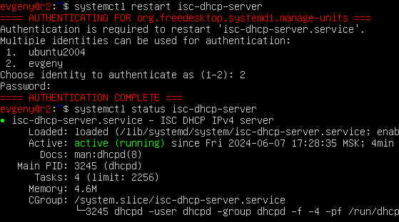

# Linux Network Report

All machines (ws11, ws21, ws22, r1, r2) use Ubuntu 20.04 without GUI.

## Part 1. ipcalc tool

- installed with <code>sudo apt-get install ipcalc</code>
  
### 1.1. Networks and masks

- network address of <em>192.167.38.54/13</em> is <em>192.160.0.0/13</em>:

  

- conversion of masks <em>255.255.255.0</em> to prefix (<em>/24</em>) and binary; <em>/15</em> to normal (<em>255.254.0.0</em>) and binary; <em>11111111.11111111.11111111.11110000</em> to normal (<em>255.255.255.240</em>) and prefix (<em>/28</em>):

- minimum and maximum hosts in <em>12.167.38.4</em> network with masks <em>/8, 11111111.11111111.00000000.00000000, 255.255.254.0</em> and <em>/4</em>:

### 1.2. localhost

- applications running on localhost can be accessed with IPs <em>127.0.0.2, 127.1.0.1</em> as they are loopbacks:

### 1.3. Network ranges and segments

- public IPs: <em>134.43.0.2, 172.0.2.1, 192.172.0.1, 172.68.0.2, 192.169.168.1</em>
  
- private IPs: <em>10.0.0.45, 192.168.4.2, 172.20.250.4, 172.16.255.255, 10.10.10.10</em>

- gateway IP addresses possible for <em>10.10.0.0/18</em> network: <em>10.10.0.2, 10.10.10.10, 10.10.1.255</em>

## Part 2. Static routing between two machines

- to use both outer and local network, added an adapter for virtual local network in VM settings:

   

- then checked available interfaces (loopback, outer and local virtual) with <code>ip a</code>:

- edited local network configuration with <code>sudo nano /etc/netplan/00-installer-config.yaml</code> on both machines and read saved files using <code>cat</code>:

- ran <code>sudo netplan apply</code> and checked that the local network is up:

### 2.1. Adding a static route manually

- used <code>ip r add</code> to connect both machines, then pinged the connection 4 times with 0% packet loss:

### 2.2. Adding a static route with saving

- restarted the machines

- edited and saved <code>/etc/netplan/00-installer-config.yaml</code> files on both machines

- ran <code>sudo netplan apply</code> and pinged the connection 4 times with 0% packet loss:

## Part 3. iperf3 utility

### 3.1. Connection speed

- 8 Mbps = 1 MB/s

- 100 MB/s = 800 000 Kbps

- 1 Gbps = 1000 Mbps

### 3.2. iperf3 utility

- installed with <code>sudo apt-get install iperf3</code>

- to measure connection speed, started server on ws11 with <code>sudo iperf3 -s</code> and ran <code>sudo iperf -c 192.168.100.10</code> on ws21:

  

## Part 4. Network firewall
  
### 4.1. iptables utility

- installed with <code>sudo apt-get install iptables</code>

- created new <code>/etc/firewall.sh</code> files and added the following on ws11 and ws21 respectively:

- ran the scripts on both machines:

- <strong>the first strategy</strong> sends packets but rejects incoming ones

- <strong>the second strategy</strong> accepts incoming packets but doesn't send them

### 4.2. nmap utility

- installed with <code>sudo apt-get install nmap</code>

- tried to ping both machines (<code>ws11</code> isn't pinged) and used <code>sudo nmap</code> to check that the hosts are up:

- saved dumps of the VM images using machine settings:

## Part 5. Static network routing

### 5.1. Configuration of machine addresses

- set up five VMs (2 routers, 3 workstations) through cloning in the Oracle VM Virtual Box Manager (importnant: generated new MAC addresses):

 

- in the Manager, changed  Settings > Network for each machine:

  - for r1: Adapter 1 (Internal Network, r1-ws11), Adapter 2 (Internal Network, r1-r2), Adapter 3 (NAT):

  - for r2: Adapter 1 (Internal Network, r1-r2), Adapter 2 (Internal Network, r2-ws21-ws22), Adapter 3 (NAT):

  - for ws11: Adapter 1 (Internal Network, r1-ws11), Adapter 2 (NAT):

  - for ws21, ws22: Adapter 1 (Internal Network, r2-ws21-ws22), Adapter 2 (NAT):

- looked up MAC addresses using <code>ip a</code> (listed for every interface next to <code>link/ether</code>)

- 2 routers (r1, r2):

- 3 workstations (ws11, ws21, ws22):

- configured <code>/etc/netplan/00-installer-config.yaml</code> files for each machine and restarted the network service with <code>sudo netplan apply</code>

- 2 routers (r1, r2):

- 3 workstations (ws11, ws21, ws22):

- checked the machine addresses with <code>ip -4 a</code>

- 2 routers (r1, r2):

- 3 workstations (ws11, ws21, ws22):

- pinged ws22 from ws21 and r1 from ws11 with 0% packet loss:

### 5.2. Enabling IP forwarding

- to enable IP forwarding, ran <code>sudo sysctl -w net.ipv4.ip_forward=1</code>:

- changed <code>/etc/sysctl.conf</code> file, adding <code>net.ipv4.ip_forward=1</code>:

### 5.3. Default route configuration

- configured default route (gateway) for the workstations in the <code>/etc/netplan/00-installer-config.yaml</code> file:

- checked that a route is added to the routing table with <code>ip r</code>:

- pinged r2 from ws11 and tracked with <code>sudo tcpdump -tn -i eth0</code>:

### 5.4. Adding static routes

- added static routes to r1 and r2 configuration files:

- called <code>ip r</code> on both routers to show route tables:

- ran <code>ip r list 10.10.0.0/18</code> and <code>ip r list 0.0.0.0/0</code> on ws11:

- <strong>default</strong> route has the lowest priority when a route is chosen according to the routing table (RT); it's applied when the destination IP matches multiple intarfaces, or there's no RT rule for it

- since <strong>10.10.0.0/18</strong> destination IP matches an existing network IP in RT, a route other than <strong>default</strong> is prioritised, contrary to <strong>0.0.0.0/0</strong>

### 5.5. Making a router list

- ran <code>sudo tcpdump -tnv -i eth0</code> on r1:

- used <code>sudo traceroute 10.20.0.10</code> to list routers from ws11 to ws21:

To construct a path, <strong>traceroute</strong> sends packets to the destination IP, each time increasing their TTL (time to live); the TTL value is first set by the source host, and when it reaches the next hop, the router decreases it by 1 before forwarding. As soon as the TTL value becomes 0, the packet is discarded, and the router informs the source host about it using the ICMP time exceeded message. The primary packet is sent with the TTL value=1 and discarded at the first hop. The next packet has the TTL value=2. 

The process is repeated until the destination is reached, allowing the source host to collect all the pathway information.

### 5.6. Using ICMP protocol in routing

- ran <code>sudo tcpdump -n -i eth0</code> on r1 and pinged a non-existent IP (10.30.0.111) from ws11:

- saved VM image dumps:

## Part 6. Dynamic IP configuration using DHCP

This task used VMs created in Part 5.

- configured the DHCP service for r2 in the <code>/etc/dhcp/dhcp.conf</code> file:

- wrote <code>nameserver 8.8.8.8</code> for r2 in the <code>/etc/resolv.conf</code> file:

- restarted the DHCP service with <code>systemctl restart isc-dhcp-service</code> and checked that the service is running:

- edited <code>/etc/netplan/00-installer-config.yaml</code> file and ran <code>reboot</code> on ws21:

- checked that ws21 has an address with <code>ip a</code> and pinged ws22 with 0% packet loss:

- specified <code>10:10:10:10:10:ba</code> MAC address at ws11 in the Manager settings and <code>/etc/netplan/00-installer-config.yaml</code> file:

- checked that ws11 has a new address:

- configured r1 similarly to r2 but with the addresses' assignment linked to the ws11 MAC-address in <code>/etc/dhcp/dhcpd.conf</code> and <code>/etc/resolv.conf</code> files:

- restarted the DHCP service and checked that rebooted ws11 got a new address:

- checked IP address before update using <code>ip addr show eth0</code>, terminated it with <code>sudo dhclient -r eth0</code> and requested a new one by running <code>sudo dhclient -4 eth0</code>:

- saved VM image dumps as described previously

## Part 7. NAT

This task used VMs created in Part 5.

- installed apache2 with <code>sudo apt-get install apache2</code>

- in <code>/etc/apache2/ports.conf</code> file changed <code>Listen 80</code> to <code>Listen 0.0.0.0:80</code> on ws22 and r1 and started the server (now public):

- checked that the server is running:

- edited <code>/etc/firewall.sh</code> file on r2, ran it as in Part 4 and checked that the rules are added to the routing table:

- pinged r1 from ws22 (output before and after running the firewall):

 

- allowed routing of ICMP packets and ran the firewall again:

- pinged r1 from ws22 with 0% packet loss:

- enabled SNAT and DNAT and ran the firewall:

Before testing, disabled NAT interface in the VM Manager settings.

- checked the TCP connection for SNAT from ws22 with <code>sudo telnet 10.100.0.11 80</code>:

- checked the TCP connection for DNAT from r1 with <code>sudo telnet 10.100.0.12 8080</code>:

- saved VM image dumps as described before

## Part 8. Introduction to SSH Tunnels

- ran a firewall on r2 with the rules from Part 7

- in file <code>/etc/ssh/sshd_config</code> on ws11, ws21, ws22 changed Port 2022 to Port 22, uncommented <code>ListenAddress</code> lines:

- in <code>/etc/apache2/ports.conf</code> file on ws22 changed port to <code>localhost:80</code> and started apache2 server; also restarted sshd with <code>sudo systemctl restart sshd</code> on ws11, ws21, ws22:

- used local TCP forwarding to access server on ws22 from ws21 with <code>ssh -L local_port:remote_ip:remote_port user@remote_ip</code> (i.e. <code>ssh -L 8888:10.20.0.20:80 evgeny@10.20.0.20</code>):

- edited firewall rules on r2 to allow TCP-packets from multiple ports with <code>-m multiport [port type] 22,80,8080</code>:

- used remote TCP forwarding to access server on ws22 from ws11 with <code>ssh -R 8888:10.20.0.20:80 evgeny@10.20.0.20</code>:

- checked the connection by running <code>sudo telnet 127.0.0.1 80</code> on ws22:

## P.s. Cool Tip

To make user hostname coloured, use <code>sudo nano .bashrc</code>, uncomment <code>force_color_prompt=yes</code> and follow the guideline:

