# Simple Docker Report

## Part 1. Ready-made docker

### 1.1. Installation

- added GPG signing key for Docker repository:

```
curl -fsSL https://download.docker.com/linux/ubuntu/gpg | sudo gpg --dearmor -o /usr/share/keyrings/docker-archive-keyring.gpg
```

- added APT Docker repository to <strong>sources.list.d folder</strong>:

```
echo "deb [arch=$(dpkg --print-architecture) signed-by=/usr/share/keyrings/docker-archive-keyring.gpg] https://download.docker.com/linux/ubuntu $(lsb_release -cs) stable" | sudo tee /etc/apt/sources.list.d/docker.list > /dev/null
```

- ran <code>sudo apt update</code>

- ran <code>sudo apt install docker-ce -y
</code>

- checked that the service is up with <code>sudo systemctl status docker</code>:

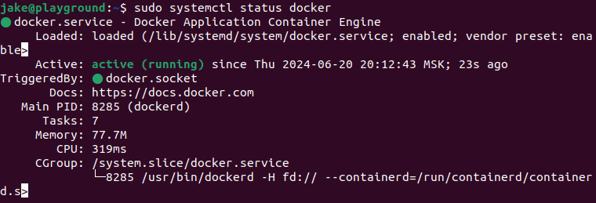

### 1.2. Working with images

- installed new image with <code>sudo docker pull ubuntu</code>

- checked for the image using <code>sudo docker images</code>:

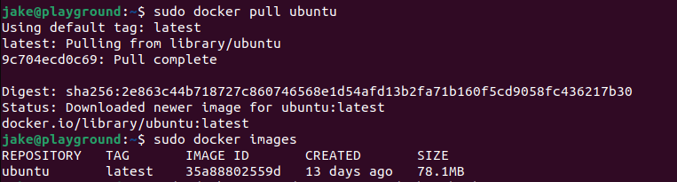

- ran the image in the background with <code>sudo docker run -dit ubuntu /bin/bash</code>

 - checked that it's running with <code>sudo docker ps</code>:

 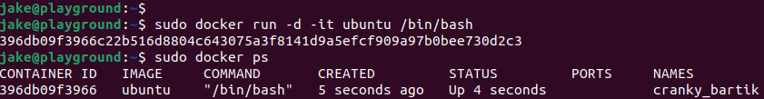

 - inspected the container with <code>sudo docker inspect -s [container_id][container_name]</code>:

  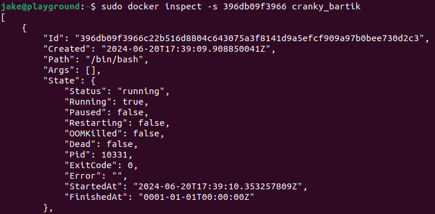

 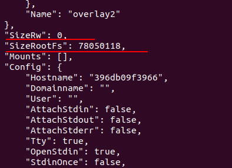

 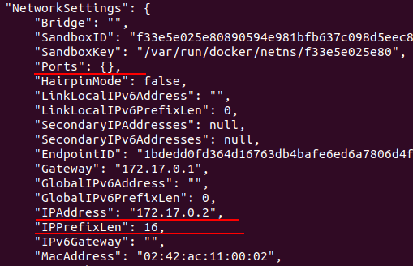

 The output shows that there are <strong>no mapped ports</strong>, the IP address is <strong>172.17.0.2/16</strong> and the container's size is <strong>78050118 bytes</strong> (78.1 Mb).

 - stopped the container with <code>sudo docker stop [container_id][container_name]</code> and checked that it's no longer running:

 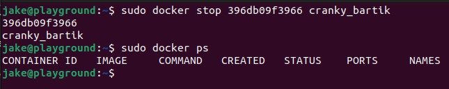

 ### 1.3. Enabling ports 80 and 443

 - enabled and checked the ports using the in-built firewall utility:

 ```
sudo ufw allow 443/tcp
sudo ufw allow 80/tcp
sudo ufw enable
sudo ufw status
 ```

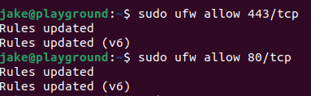

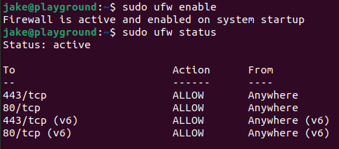

- ran image with ports 443 and 80 mapped to the local ones, checked that it's running:

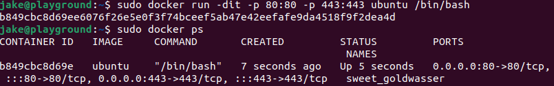

- installed <code>nginx</code> utility with <code>sudo apt install nginx-core</code>, checked that it's running and the start page is available at http://localhost:

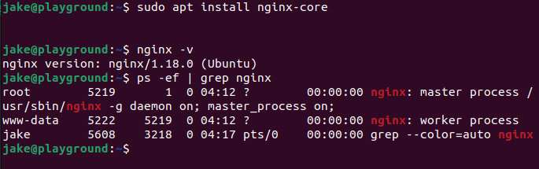

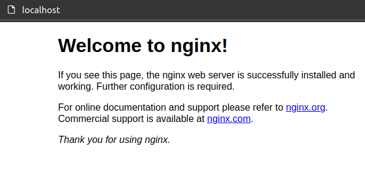

- restarted the container with <code>sudo docker restart [container_id][container_name]</code> and checked that it's running:

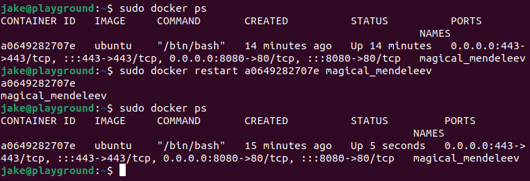

## Part 2. Operations with container

- ran nginx image and read the <strong>/etc/nginx/nginx.conf</strong> file:

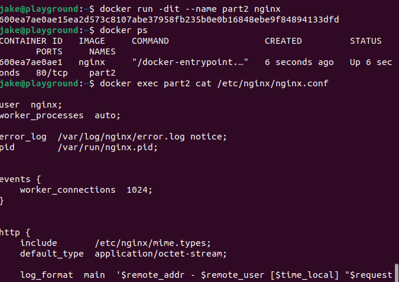

- opened and configured said file on a local machine:

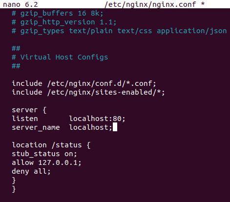

- checked that there are no errors, <code>nginx</code> has a stub_status module and the status page returns valid data:

```
sudo nginx -V 2>&1 | grep -o with-http_stub_status_module
sudo nano /etc/nginx/nginx.conf
sudo nginx -t
sudo nginx -s reload OR sudo systemctl restart nginx
curl http://localhost:80/status
```

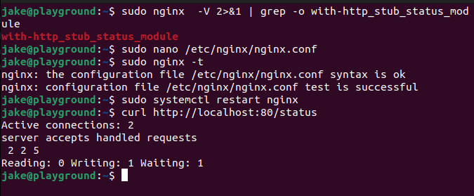

- copied the file to the container with <code>sudo docker cp SOURCE [container_name]:DESTINATION</code>

- restarted <code>nginx</code> in the container using <code>exec</code>

- checked that <strong>localhost:80/status</strong> has status data:

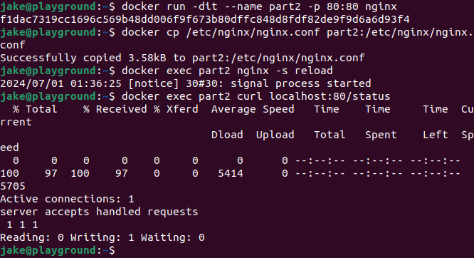

- exported the container to a <strong>container.tar</strong> file with <code>sudo docker export [container_name] > FILE_NAME</code>

- deleted the image then the container with <code>sudo rmi -f [image_id][folder]</code>

- deleted the container with <code>sudo rm [container_name]</code>

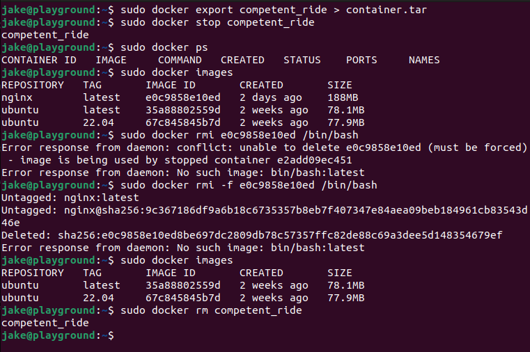

- imported the image back with <code>sudo docker import</code> and ran a container based on it:

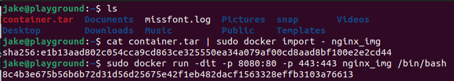

- checked that the status page works on the new container:

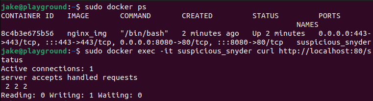

## P.s. Adding docker to sudo group

```
sudo groupadd docker
sudo usermod -aG docker $USER
newgrp docker
reboot
```